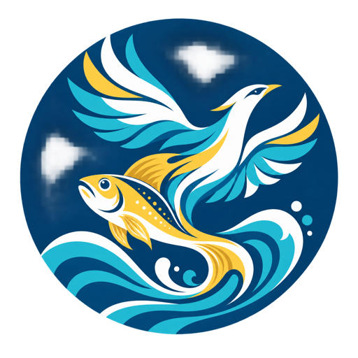

# 鲲鹏智育 Kunpeng SmartBreed

面向 **大黄鱼（*Larimichthys crocea*）遗传育种** 的科研智能体，基于开源 DeepSeek Harness（dsh）构建。

  

> 名字由来：**鲲鹏** —— 取《庄子·逍遥游》「北冥有鱼，其名为鲲……化而为鸟，其名为鹏」。**鲲** 是大鱼，**鹏** 是徐鹏老师课题组，暗合「大黄鱼 + 遗传育种」的身份；**智育** —— AI 智慧育种。
> English: **Kun** = the great fish, **Peng** = Prof. Xu Peng's lab, **SmartBreed** = AI-driven breeding.

## 它是什么

鲲鹏智育是一个 **DeepSeek Harness 智能体预设（Agent Preset）+ 专业技能包 + 课题组知识库**，让 dsh 会话以「大黄鱼育种专家」的身份工作，覆盖科研全流程：

| 模块 | 能力 |
|---|---|
| 文献知识检索与问答 | 先检索证据再回答，强制返回来源/DOI/原文片段；无证据明示「尚无充分证据」 |
| 组学与数据分析工作流 | RNA-seq / GWAS / 基因组选择（GS）等受控流程，输入确认 + 可复现实验记录 |
| 育种数据治理 | 以「个体」为中心的数据模型、六类基础质控、暂存—校验—审核—入库闭环 |
| 亲族选配决策 | 近交系数、亲缘关系、育种值预测、多目标选配，附收益/风险/不确定性说明 |
| 课题组知识库问答 | 内置实验安全与操作规范、仪器与实验技术、养殖与鱼排管理、送测与种质鉴定、繁育计划、数据档案等课题组内部知识 |

恪守四项原则：**证据可追溯、计算可复现、决策可解释、数据可治理**。模型是对话入口与结果解释器，不是事实与决策的唯一来源。

## 版本

- v1.0.0（当前）：完整智能体预设 + 5 个专业技能 + 课题组知识库 + 近交系数计算工具

## 快速开始

### 1. 安装到 DeepSeek Harness

运行一键安装脚本（自动将预设、技能与知识库复制到 dsh 对应目录）：

    bash scripts/install.sh          # macOS / Linux
    powershell -ExecutionPolicy Bypass -File scripts/install.ps1   # Windows

也可以手动复制：

    cp -r presets/kunpeng-smartbreed <dsh目录>/apps/cli/config/agent-presets/
    cp -r skills/kunpeng-* <dsh目录>/.agents/skills/
    mkdir -p <dsh目录>/.agents/knowledge && cp knowledge/md/*.md <dsh目录>/.agents/knowledge/

> 安装后重启 dsh，在智能体界面即可看到新预设「**鲲鹏智育**」。

### 2. 使用

- 在智能体界面选择预设「鲲鹏智育」开启育种专家会话。
- **文献问答**：直接提问（如「大黄鱼抗病基因研究进展」），智能体按证据引用规范回答。
- **课题组知识问答**：提问实验操作、流程或联系人（如「PIT 注射的步骤是什么」「芯片送测找谁」），智能体检索内置知识库回答并注明来源页面。
- **近交分析**：`python3 tools/inbreeding.py pedigree.csv` 计算近交系数。
- **选配建议**：提供谱系/表型/基因型数据，智能体生成多套选配方案供专家审核。

## 课题组知识库

内置知识来自课题组腾讯文档知识空间（《大黄鱼育种组》），整理为 `knowledge/md/` 下的 Markdown 文件：

| 分类 | 文件 |
|---|---|
| 实验安全与操作规范 | 实验室安全与管理规范、养殖规范、PIT注射操作规范、常见病害防治 |
| 仪器与实验技术 | 实验室仪器的使用方法及其注意事项、常用实验技术方法及注意事项（石蜡切片/分子克隆/基因组选择/基因编辑/测鱼宝/YOLO-feed/游泳能力/心率/三倍体/代谢）、养殖实验相关装置使用规范 |
| 日常事务 | 近期工作、拉鱼/用池计划、实验安排、2026 繁育计划、鱼排管理、芯片送测、种质鉴定、物资盘点 |
| 数据档案 | 重测序数据位置、已发表公开基因组数据（NCBI/NGDC 登录号） |

### 如何添加/更新知识

知识库就是普通的 Markdown 文件，加数据分三步：

1. **新增或修改页面**：在 `knowledge/md/` 下新建 `xxx.md`，或编辑已有文件，格式为「标题 + 正文」。原始抓取文本保留在 `knowledge/raw/`（如后续想重新清洗可参考）。
2. **保持命名规范**：文件名即页面标题；涉及负责人/联系人的信息请注明姓名；表格数据尽量转成 Markdown 表格或清单。
3. **重新安装**：修改后重新运行 `scripts/install.sh`（或把 `knowledge/md/*.md` 复制到 `<dsh目录>/.agents/knowledge/`），重启 dsh 即可生效。

> 提示：想从腾讯文档等在线知识空间同步内容，可在 `knowledge/raw/` 保留原文，清洗脚本逻辑见各文件整理方式；知识更新后建议在仓库提交说明中写明来源页面。

## 工具

### tools/inbreeding.py — 近交系数计算器

Tabular 法计算近交系数与共祖矩阵，纯标准库、可离线运行。

    python3 tools/inbreeding.py pedigree.csv
    python3 tools/inbreeding.py pedigree.csv -o result.csv

输入 CSV：`id,father,mother`（未知亲本留空）。输出：每个个体的近交系数 F。

## 目录结构

    kunpeng-smartbreed/
    ├── presets/kunpeng-smartbreed/   # dsh Agent Preset（persona + 工具组合）
    │   ├── preset.yml                # 预设元数据
    │   └── agent.cordis.yml          # 智能体组合定义（系统提示词 + 工具）
    ├── skills/                       # 专业技能（SKILL.md）
    │   ├── kunpeng-literature/       # 文献知识检索与问答
    │   ├── kunpeng-workflow/         # 组学与数据分析工作流
    │   ├── kunpeng-governance/       # 育种数据治理
    │   ├── kunpeng-mating/           # 亲族选配决策
    │   └── kunpeng-knowledge/        # 课题组知识库技能
    ├── knowledge/                    # 课题组知识库
    │   ├── md/                       # 结构化知识页面（Markdown）
    │   └── raw/                      # 腾讯文档原始抓取文本
    ├── tools/                        # 育种计算工具
    │   └── inbreeding.py             # 近交系数计算器
    └── scripts/                      # 一键安装脚本

## 设计依据

本智能体按《大黄鱼智能育种 AI 平台建设方案》设计，覆盖：文献知识、组学分析、育种数据管理、选配决策的一体化科研智能系统；以课题组数据资产和经过验证的科研流程为核心，构建可追溯、可复现、可审核的智能育种平台。

## 声明

- 本项目为科研辅助工具：所有文献结论、分析结果与选配建议须由领域专家审核后用于实际决策。
- 课题组知识库仅供课题组内部使用，涉及内部流程、联系人、采购与数据位置等信息请勿对外传播。
- 与 DeepSeek 官方无隶属关系；DeepSeek Harness 为 [deepseek-ai/deepseek-harness](https://github.com/deepseek-ai/deepseek-harness) 开源项目。
- 许可证：MIT
